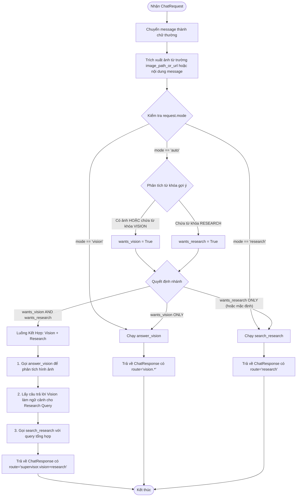

# Tài Liệu Kỹ Thuật (Technical Document) - Visual Agent

Tài liệu này mô tả chi tiết kiến trúc hệ thống, luồng dữ liệu (flows), cơ chế định tuyến (routing) và cách thức vận hành của dự án **Visual Agent**.

---

## 1. Tổng Quan Dự Án

**Visual Agent** là một ứng dụng web local (chuyển đổi và nâng cấp từ notebook prototype `workspace.ipynb`) kết hợp hai nhóm tác vụ chính:
1. **Thị giác máy tính (Vision)**: Mô tả nội dung hình ảnh bằng mô hình ngôn ngữ lớn thị giác (VLM) và phát hiện, đếm đối tượng bằng mô hình YOLOv11.
2. **Nghiên cứu khoa học (Research)**: Thu thập kiến thức nền tảng và bài báo học thuật thông qua Wikipedia API và arXiv API, sau đó tổng hợp bằng mô hình ngôn ngữ lớn (LLM).

Hệ thống được thiết kế theo hướng **Supervisor-First**, trong đó người dùng chỉ tương tác trực tiếp với giao diện trò chuyện tổng quát, và hệ thống sẽ tự động phân tích ý định để định tuyến (route) xử lý phù hợp.

---

## 2. Cấu Trúc Thư Mục

```text
visual-agent/
├── app/                        # Backend FastAPI
│   ├── config.py               # Quản lý cấu hình hệ thống (.env, cache, paths)
│   ├── main.py                 # FastAPI Entrypoint & REST APIs
│   ├── models.py               # Khai báo schema dữ liệu Pydantic v2
│   ├── services/               # Logic nghiệp vụ độc lập
│   │   ├── image_io.py         # Trích xuất, encode và quản lý hình ảnh
│   │   ├── llm.py              # Kết nối providers (Ollama, OpenAI, Gemini)
│   │   ├── research.py         # Tìm kiếm Wikipedia, arXiv & tổng hợp LLM
│   │   ├── router.py           # Router thủ công (manual routing)
│   │   └── vision.py           # Phân tích ảnh (VLM) & YOLO object detection
│   └── static/                 # Frontend static assets (sau khi npm run build)
├── data/                       # Dữ liệu runtime
│   ├── .cache/                 # Cache cho YOLO, matplotlib, xdg
│   └── uploads/                # Ảnh upload của user và ảnh YOLO annotated
├── docs/                       # Tài liệu dự án
│   ├── knowledge.md            # Nhật ký kiến thức & Debugging log
│   └── technical_document.md   # Tài liệu kỹ thuật chi tiết (file này)
├── frontend/                   # Frontend Vue 3 + Vite + TypeScript
│   ├── src/
│   │   ├── App.vue             # Component gốc, quản lý layout và state chính
│   │   ├── api/
│   │   │   └── client.ts       # Wrapper gọi API tới backend FastAPI
│   │   ├── components/         # Các panel UI (TopBar, Console, Settings, v.v.)
│   │   └── types/              # Định nghĩa type TypeScript cho API
│   ├── vite.config.ts          # Cấu hình Vite & API Proxy
│   └── package.json
├── scripts/                    # Shell scripts để chạy local và build
│   ├── build_frontend.sh       # Script build tự động frontend sang app/static/
│   ├── run_local.sh            # Script khởi chạy FastAPI local server
│   └── setup_native_ollama.sh  # Bootstrap Ollama native + YOLO weights cho Docker mode
├── models/                     # Weights runtime được mount vào Docker container
├── Dockerfile                  # Multi-stage build: Vue frontend + FastAPI runtime
├── docker-compose.yml          # Chạy app Docker, kết nối Ollama native trên host
├── AGENTS.md                   # Hướng dẫn dành cho AI Agents / Codex
├── requirements.txt            # Dependencies Python
└── yolo11x.pt                  # Weights YOLOv11 cho local dev cũ nếu còn dùng
```

---

## 3. Kiến Trúc Hệ Thống (System Architecture)

Dự án được xây dựng theo kiến trúc Client-Server với các thành phần cốt lõi:

```mermaid
graph TD
    subgraph Client (Frontend)
        Vue[Vue 3 SPA] <--> API_Client[API Client Wrapper]
    end

    subgraph Server (FastAPI Backend)
        API_Client <--> Main[app/main.py]
        Main <--> Config[app/config.py]
        Main <--> Router[app/services/router.py]
        
        Router --> Research[app/services/research.py]
        Router --> Vision[app/services/vision.py]
        
        Research --> Wikipedia[Wikipedia API Wrapper]
        Research --> arXiv[arXiv API Client]
        Research --> LLM_Svc[app/services/llm.py]
        
        Vision --> YOLO[YOLOv11 Model local]
        Vision --> LLM_Svc
    end

    subgraph AI/API Providers
        LLM_Svc <--> Ollama[Ollama Native Host Server]
        LLM_Svc <--> OpenAI[OpenAI API]
        LLM_Svc <--> Gemini[Gemini REST API]
    end
```

### Chế độ triển khai khuyến nghị

Chế độ hiệu năng tốt của repo là **Docker app + Ollama native**:

- FastAPI, frontend static assets, Python dependencies và YOLO runtime chạy trong Docker container `app`.
- Ollama chạy native trên máy host để tận dụng tài nguyên local tốt hơn, đặc biệt trên macOS Apple Silicon.
- Container gọi Ollama host qua `OLLAMA_BASE_URL=http://host.docker.internal:11434`.
- `docker-compose.yml` có `extra_hosts: ["host.docker.internal:host-gateway"]` để hỗ trợ Linux.
- `.env` được bind mount vào `/app/.env`, vì vậy khi user đổi provider/API key trong Settings thì thay đổi vẫn lưu lại trên host.
- YOLO weights không nằm trong image Docker; file `models/yolo11x.pt` được mount read-only vào `/app/models/yolo11x.pt`.

---

## 4. Luồng Định Tuyến Trò Chuyện (Manual Routing Flow)

Vì các mô hình cục bộ nhỏ chạy trên thiết bị cá nhân (ví dụ: `llama3.2:3b`) thường không ổn định và dễ gặp lỗi khi tự quyết định công cụ (tool-calling / agentic supervisor), dự án sử dụng **cơ chế định tuyến thủ công (manual routing)** trong `app/services/router.py`.

Khi frontend gửi yêu cầu với chế độ mặc định `mode="auto"`, backend thực hiện phân tích cú pháp tin nhắn và đường dẫn ảnh để phân loại luồng như sau:



### Từ khóa định tuyến (Routing Hints)
- **RESEARCH_HINTS**: `research`, `paper`, `papers`, `arxiv`, `wikipedia`, `latest`, `nghiên cứu`, `bài báo`, `tài liệu`.
- **VISION_HINTS**: `image`, `photo`, `picture`, `ảnh`, `hình`, `.png`, `.jpg`, `.jpeg`, `.webp`, `detect`, `count`, `describe`.

---

## 5. Chi Tiết Luồng Hoạt Động của Các Services

### A. Research Service (`app/services/research.py`)
Mục tiêu là tìm kiếm và tổng hợp thông tin học thuật từ Wikipedia và arXiv một cách ổn định, tránh bị rate-limit bởi arXiv (lỗi `HTTP 429`).

1. **Làm sạch truy vấn (`_clean_research_query`)**:
   - Loại bỏ các từ dừng tự nhiên (`what`, `tell me`, `is`, `the`, `latest`, `research`, `papers`, v.v.) và các ký tự đặc biệt ở cuối câu. Điều này giúp tối ưu hóa kết quả tìm kiếm bằng từ khóa (keyword search) cho Wikipedia và arXiv.
2. **Xử lý arXiv nâng cao**:
   - Tạo các biến thể số ít/số nhiều cho chủ đề tìm kiếm bằng `_topic_variants`.
   - Tạo câu truy vấn arXiv có cấu trúc dạng: `ti:"chủ đề" OR abs:"chủ đề"` nhằm khớp chính xác vào tiêu đề hoặc tóm tắt của bài báo, giảm thiểu các kết quả nhiễu.
   - Nếu trong câu hỏi ban đầu có các từ khóa chỉ thời gian gần đây (`latest`, `recent`, v.v.), arXiv sẽ được cấu hình để sắp xếp theo ngày nộp bài báo giảm dần (`SubmittedDate`), nếu không sẽ sắp xếp theo độ liên quan (`Relevance`).
   - Sử dụng `arxiv.Client(page_size=3, delay_seconds=5.0, num_retries=5)` thay thế cho việc gọi trực tiếp API wrapper mặc định của LangChain để kiểm soát tốc độ request, tránh lỗi 429.
3. **Gọi API song song (try-except cô lập)**:
   - Truy vấn Wikipedia (lấy tối đa 2 kết quả, giới hạn độ dài 3000 ký tự).
   - Truy vấn arXiv (lấy tối đa 3 kết quả, giới hạn độ dài 3500 ký tự).
   - Nếu một trong các API lỗi, hệ thống bắt exception và ghi chú lại lỗi thô thay vì làm crash toàn bộ app.
4. **Tổng hợp LLM**:
   - Dựng prompt yêu cầu LLM đóng vai trò trợ lý khoa học, tổng hợp kiến thức nền tảng (Wikipedia) và các nghiên cứu cụ thể (arXiv) bằng tiếng Anh.
   - Nếu việc kết nối LLM thất bại, trả về trực tiếp dữ liệu thô thu được từ các API kèm mã lỗi để hiển thị lên màn hình console.

### B. Vision Service (`app/services/vision.py`)
Service này chịu trách nhiệm xử lý hình ảnh dựa trên yêu cầu của người dùng, phân tách thành 2 tính năng chính:

1. **Phát hiện & Đếm Đối tượng (YOLO)**:
   - Được kích hoạt khi tin nhắn chứa các từ khóa đếm/nhận diện (`COUNT_WORDS` như: `count`, `how many`, `detect`, `đếm`, `bao nhiêu`, `phát hiện`).
   - Gọi mô hình YOLOv11 (`yolo11x.pt`) đã được tải và cache trong bộ nhớ.
   - Trích xuất danh sách bounding boxes, nhãn lớp (class label), độ tự tin (confidence score).
   - Sử dụng thư viện OpenCV (`cv2`) vẽ trực tiếp khung nhận diện lên ảnh (`result.plot()`), lưu ảnh đã vẽ này vào `data/uploads/annotated-{uuid}.jpg` và lấy URL để hiển thị trên frontend.
   - Nếu prompt hỏi cụ thể một đối tượng trong danh sách phát hiện được (ví dụ: "có bao nhiêu người?"), hệ thống đếm riêng đối tượng đó. Ngược lại, trả về danh sách đếm tổng quát của mọi vật thể phát hiện được.
2. **Mô tả Hình ảnh (VLM)**:
   - Kích hoạt cho các câu hỏi thông thường về ảnh.
   - Chuyển đổi đường dẫn ảnh local hoặc URL ảnh thành Base64 Data URL thông qua `image_io.py`.
   - Gọi mô hình VLM hoạt động (Ollama vision, OpenAI vision, hoặc Gemini vision) với prompt của người dùng.

### C. LLM/VLM Service (`app/services/llm.py`)
Đóng vai trò là cầu nối với các nhà cung cấp mô hình trí tuệ nhân tạo (AI Providers):

- **Ollama (Local)**:
   - Sử dụng thư viện `langchain-ollama`.
   - Sử dụng decorator `@lru_cache` để tái sử dụng instance `ChatOllama` cho text và vision, tránh việc khởi tạo lại liên tục gây lãng phí tài nguyên.
   - Cấu hình mặc định: `temperature=0` nhằm đảm bảo tính chính xác cao và tránh sinh từ ngữ lan man cho các tác vụ tổng hợp hoặc trích xuất thông tin.
- **OpenAI (Cloud)**:
   - Sử dụng thư viện chính thức `openai` Python SDK.
   - Gọi mô hình text (`gpt-4.1-nano` hoặc do người dùng cấu hình) và mô hình vision (`gpt-4o-mini`).
- **Gemini (Cloud)**:
   - Gọi trực tiếp thông qua Google Generative Language REST API sử dụng thư viện `requests` thay vì cài thêm SDK nặng.
   - Dữ liệu hình ảnh được truyền dưới dạng `inline_data` chứa base64 trực tiếp.
   - Xử lý lỗi HTTP nâng cao: Tự động loại bỏ khoá API (`key=...`) khỏi chuỗi URL lỗi trước khi ném ra exception nhằm bảo mật key tối đa (không bao giờ hiển thị key ra màn hình UI hoặc log).

### D. Image I/O Service (`app/services/image_io.py`)
- **`extract_image_reference(text)`**: Sử dụng Regular Expression mạnh mẽ (`IMAGE_REF_RE`) để tự động tìm kiếm đường dẫn tệp local hoặc URL internet chứa ảnh định dạng `.png`, `.jpg`, `.jpeg`, `.webp` bên trong tin nhắn tự do của người dùng.
- **`get_mime_type(path_or_url)`**: Xác định MIME type của ảnh. Đối với tệp tin cục bộ, sử dụng thư viện `python-magic` (`libmagic`) để đọc header tệp thật, tránh phụ thuộc vào phần mở rộng đuôi file dễ bị làm giả.
- **`encode_image_data_url(path_or_url)`**: Đọc ảnh từ local hoặc fetch từ internet, sau đó mã hóa sang cấu trúc Base64 Data URL chuẩn phục vụ cho VLM.

---

## 6. Luồng Dữ Liệu Phía Frontend (Frontend Workflow)

### A. Kiến trúc Giao diện & Layout
Giao diện frontend Vue 3 được lấy cảm hứng thiết kế từ phong cách **knowte** (Space/Alien/Technology dark theme):
- Tông màu chủ đạo: Nền đen sâu (Deep space `#04080f`) kết hợp màu xanh mòng két nổi bật (Teal accent `#00c8b4`).
- Font stack dạng monospace (`Menlo`, `Space Mono`) mang phong cách bảng điều khiển kỹ thuật (dense operational UI).
- Bo góc sắc nét (`radius: 3px`).

Bố cục giao diện được chia thành hai cột chính (tự động chuyển thành 1 cột trên thiết bị di động):
1. **Cột trái (Input & Process Visualization)**:
   - **`MissionPanel.vue`**: Nơi người dùng nhập prompt, xem trước ảnh đã tải lên, nhấn nút upload ảnh, hoặc click chạy nhiệm vụ.
   - **`WorkflowPanel.vue`**: Panel hiển thị trực quan tiến trình hoạt động dưới dạng timeline động. Khi bắt đầu chạy, panel sẽ hiển thị animation trạng thái xử lý hiện tại (đang phân tích ảnh, đang đếm YOLO, đang tìm kiếm arXiv/Wikipedia, hoặc đang gọi LLM tổng hợp).
2. **Cột phải (Result & Telemetry)**:
   - **`ConsolePanel.vue`**: Màn hình hiển thị câu trả lời cuối cùng ở dạng markdown, danh sách nguồn tham khảo (sources) cùng với ảnh YOLO đã được vẽ khung nhận diện (nếu có).
3. **Phần trên cùng**:
   - **`TopBar.vue`**: Thanh trạng thái hiển thị thông tin đo đạc (telemetry) về model đang chạy và nút cấu hình hệ thống (Settings).

### B. Settings & API Keys Security
- Người dùng có thể click nút `SETTINGS` để mở **`SettingsModal.vue`** và chọn provider cho LLM và VLM độc lập (Ollama, OpenAI, Gemini).
- Nếu chọn các cloud provider (OpenAI, Gemini), frontend sẽ kiểm tra xem API key đã được thiết lập chưa. Người dùng nhập key trực tiếp trên form và gửi lên qua phương thức `POST /api/settings`.
- **Nguyên tắc bảo mật**:
  - `GET /api/settings` chỉ trả về cờ boolean `has_openai_api_key` và `has_gemini_api_key` đại diện cho việc key đã tồn tại ở `.env` hay chưa. **Tuyệt đối không bao giờ trả lại chuỗi API key thô về phía client**.
  - Các key được cập nhật trực tiếp vào file `.env` ở root của backend và reload cài đặt nóng vào RAM thông qua hàm `reload_settings()`.

---

## 7. Các Lệnh Chạy Cốt Lõi (Core Commands)

### Chạy hệ thống local (FastAPI serve built frontend):
```bash
./scripts/run_local.sh
```
*Giao diện chạy tại:* `http://127.0.0.1:8300`

### Khởi động Frontend trong chế độ phát triển (Dev Mode):
```bash
cd frontend
npm install
npm run dev
```
*Vite Server chạy tại:* `http://127.0.0.1:5177` (Mọi truy vấn tới `/api` và `/uploads` sẽ được proxy về FastAPI ở port `8300`).

### Build lại Frontend thủ công:
```bash
./scripts/build_frontend.sh
```
*(Hoặc `cd frontend && npm run build`)* - Bản build tĩnh sẽ được sao chép vào `app/static/` để FastAPI phân phối trực tiếp.

### Kiểm tra nhanh backend (Smoke Test):
```bash
venv/bin/python - <<'PY'
from fastapi.testclient import TestClient
from app.main import app

client = TestClient(app)
print("Health Status Code:", client.get("/api/health").status_code)
print("Chat Response:", client.post("/api/chat", json={"mode": "vision", "message": "describe this image"}).json())
PY
```
